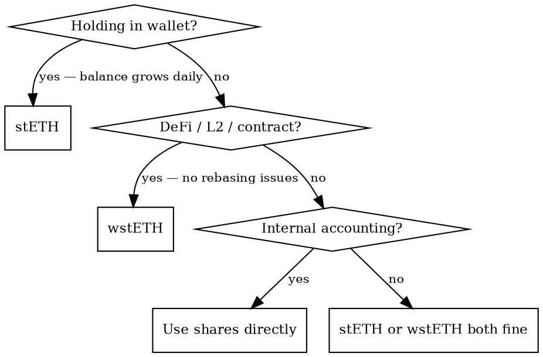

# Lido Protocol

## Overview

Lido is a liquid staking protocol for Ethereum. Deposit ETH, receive **stETH** (rebasing) or **wstETH** (non-rebasing wrapper). Rewards accrue automatically via daily oracle rebases. This skill provides the domain knowledge needed to correctly use the `lido_*` MCP tools.

## When to Use

- User wants to stake ETH, unstake, wrap/unwrap, or check balances
- User asks about staking yield, APR, or rewards
- User wants to vote on Lido DAO proposals
- You need to decide between stETH and wstETH for a use case
- You're integrating stETH into a smart contract or DeFi protocol
- Withdrawal is stuck or taking longer than expected

## Quick Reference — Tools

| Tool | Type | What it does |
|------|------|-------------|
| `lido_stake` | write | ETH → stETH |
| `lido_unstake` | write | stETH/wstETH → withdrawal request (auto-approves) |
| `lido_claim_withdrawal` | write | Claim finalized ETH |
| `lido_wrap` | write | stETH → wstETH, or ETH → wstETH (atomic) |
| `lido_unwrap` | write | wstETH → stETH |
| `lido_balance` | read | ETH/stETH/wstETH balances + shares |
| `lido_rewards` | read | Staking rewards history |
| `lido_apr` | read | Current APR + 7-day SMA |
| `lido_withdrawal_status` | read | Pending/claimable withdrawals |
| `lido_governance_proposals` | read | Lido DAO Aragon votes |
| `lido_governance_vote` | write | Vote FOR/AGAINST (requires LDO) |

All write tools support `dry_run: true` — **always dry-run first** for non-trivial amounts.

## Token Decision

**Rule of thumb:** If in doubt, use **wstETH**. It's safe everywhere.

## Core Concepts

### stETH — Rebasing Token
- Balance = `shares * totalPooledEther / totalShares` (changes daily)
- **1-2 wei rounding loss** on transfers due to integer division — use `transferShares()` for precision
- Does NOT emit `Transfer` event on rebase (only on explicit transfers) — not strictly ERC-20
- Oracle: 9 oracles, 5/9 quorum, daily. Sanity caps: 27% APR max, 5% staked drop max

### wstETH — Non-Rebasing Wrapper
- 1 wstETH = 1 share (exact, no rounding). Value increases as exchange rate grows
- Exchange rate: `wstETH.stEthPerToken()` — monotonically increasing
- **Only token to bridge to L2** — bridging stETH prevents reward collection

### Rewards
- APR: typically 3-5%. Sources: consensus rewards + execution tips/MEV
- 10% protocol fee (5% node operators, 5% treasury) — collected via share minting
- Auto-compounding after V2

## Key Limits

| Parameter | Value |
|-----------|-------|
| Min withdrawal | 100 wei stETH |
| Max per withdrawal request | 1000 stETH |
| Staking rate limit | Sliding 24h window, check `getCurrentStakeLimit()` |
| Governance main phase | 48h (FOR or AGAINST) |
| Governance objection phase | 24h (AGAINST only) |
| Governance quorum | 5% of total LDO supply |
| Easy Track objection window | 72h (passes unless 0.5% object) |

## Withdrawal Queue — Lifecycle

1. **Request** → receive unstETH NFT (ERC-721). Non-cancellable once placed.
2. **Wait** → 1-5 days typically. No rewards during wait (burned on finalization).
3. **Claim** → ETH received, NFT burned. Use `findCheckpointHints()` for gas savings.

- NFT is transferable — current holder claims
- **Bunker mode**: rare protocol stress indicator, check `isBunkerModeActive()`. Longer waits.
- Finalization needs: sufficient ETH in Lido buffer + timelock elapsed
- Request variants: standard, with ERC-2612 permit, wstETH, wstETH with permit

## Governance

- **Aragon Voting**: LDO token holders. Voting power snapshotted at vote creation.
- **Easy Track**: routine proposals, pass by default unless 0.5% object within 72h.
- Available on Mainnet and Holesky testnet.

### LDO Token Addresses
| Network | Address |
|---------|---------|
| Mainnet | `0x5A98FcBEA516Cf06857215779Fd812CA3beF1B32` |
| Holesky | `0x14ae7daeecdf57034f3E9db8564e46Dba8D97344` |

**Gotcha**: LDO `transfer()`/`transferFrom()` return `false` on failure instead of reverting.

## Common Mistakes

| Mistake | Fix |
|---------|-----|
| Using stETH in DeFi protocol | Use wstETH — rebasing breaks most contracts |
| Caching stETH balance > 24h | Re-query — balance changes daily on rebase |
| Sending stETH to contract that stores balance | Use wstETH or track shares, not balances |
| Bridging stETH to L2 | Bridge wstETH only — stETH loses rewards |
| `transfer()` loses 1-2 wei | Use `transferShares()` for exact amounts |
| Large withdrawal in one request | Split into chunks ≤ 1000 stETH |
| Staking without checking limit | Call `getCurrentStakeLimit()` first |
| Using `requestWithdrawalsWithPermit()` without fallback | Permit can be front-run — fallback to standard `requestWithdrawals()` |
| Valuing stETH/wstETH at market price for collateral | Use exchange rate feeds, not market price (AAVE v3 pattern) |
| Assuming governance works on testnet with zero addresses | Both Mainnet and Holesky have real Aragon Voting contracts |

## Common Workflows

### Stake ETH
1. `lido_apr` — check current yield
2. `lido_stake` with `dry_run: true` — preview
3. `lido_stake` — execute

### Withdraw to ETH
1. `lido_unstake` with `dry_run: true` — preview
2. `lido_unstake` — submit (auto-approves stETH)
3. `lido_withdrawal_status` — poll until claimable
4. `lido_claim_withdrawal` — receive ETH

### Use stETH in DeFi
1. `lido_wrap` — stETH → wstETH (or ETH → wstETH atomic)
2. Deploy wstETH in protocol
3. `lido_unwrap` — wstETH → stETH when done

### Participate in Governance
1. `lido_governance_proposals` with `active_only: true`
2. `lido_governance_vote` with `dry_run: true` — verify eligibility
3. `lido_governance_vote` — cast vote
